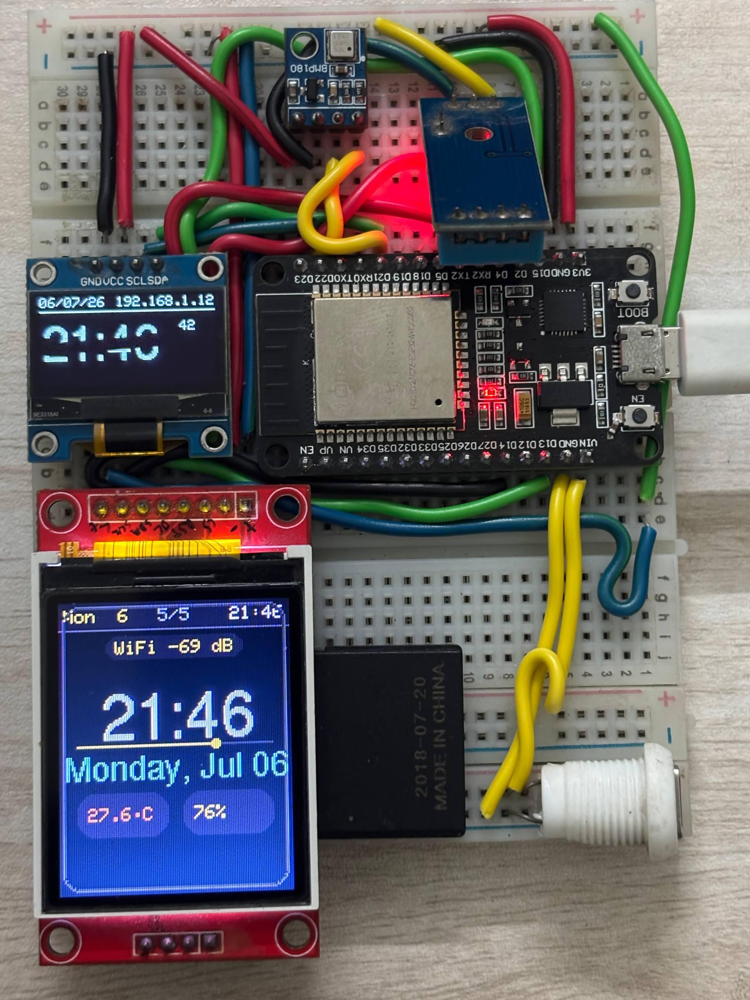
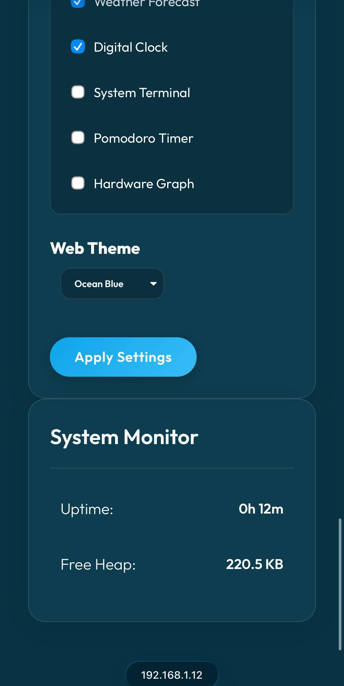
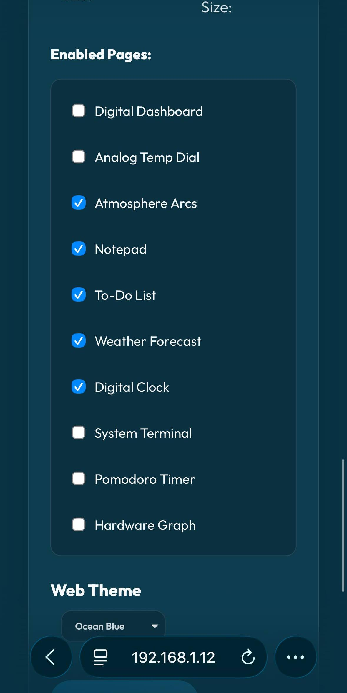
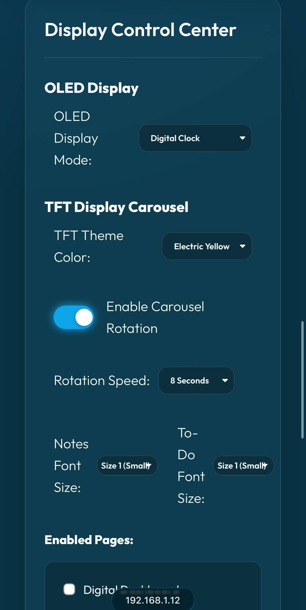
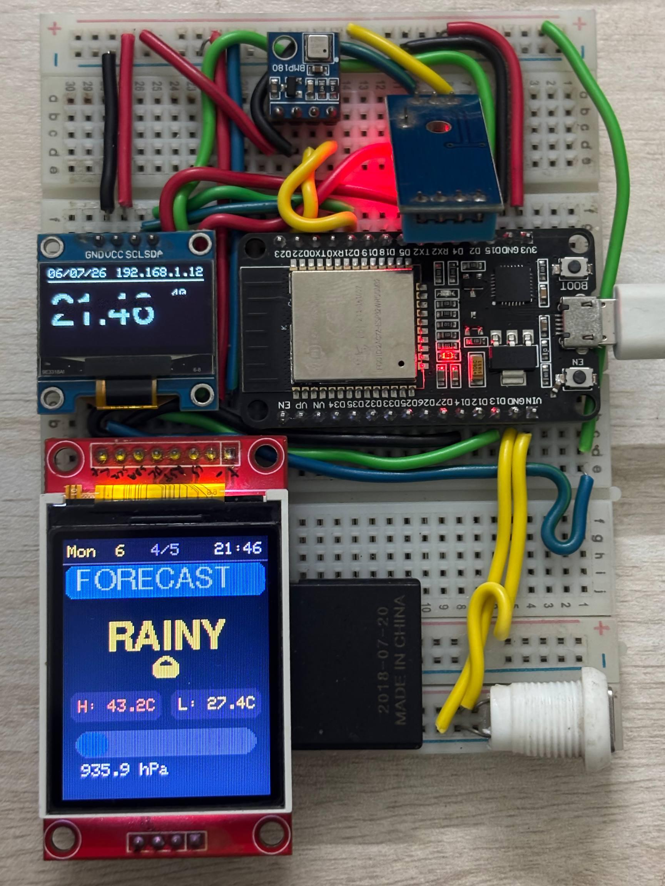
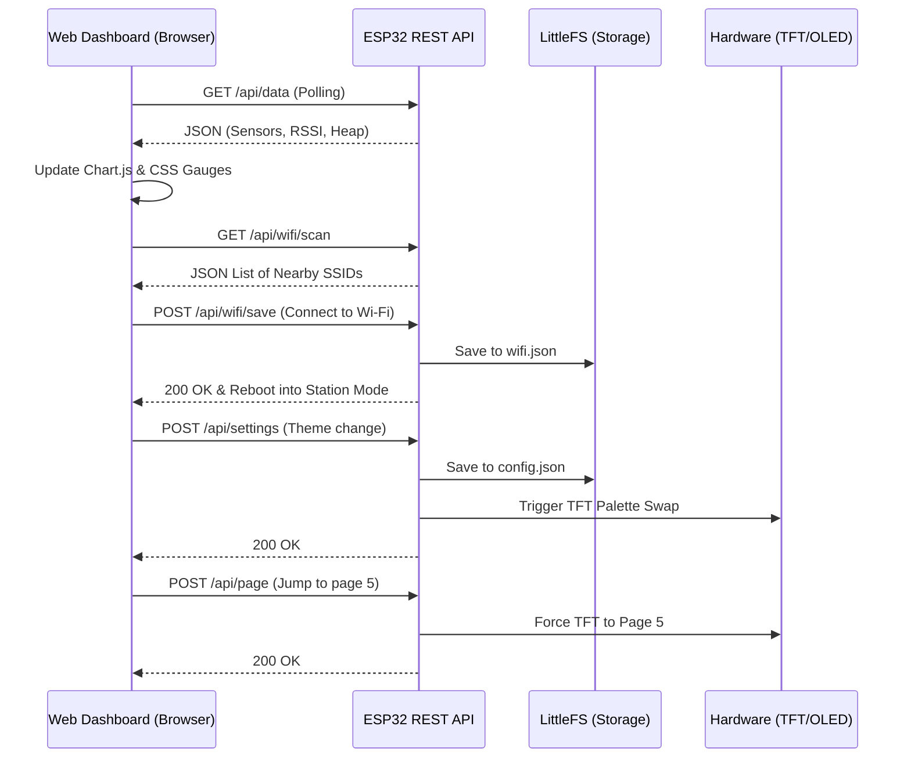
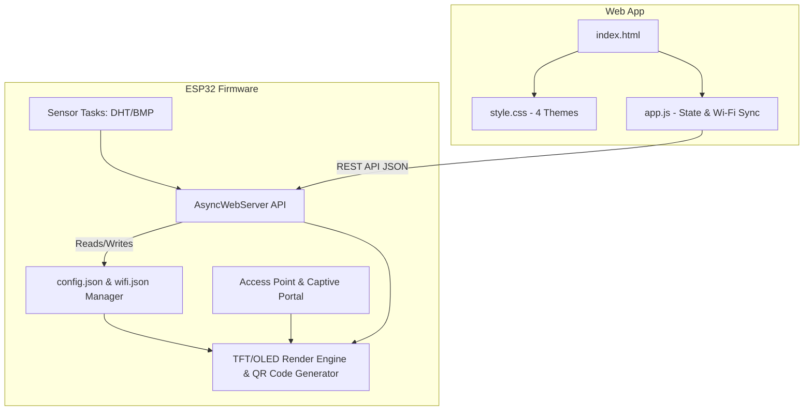

# 🌌 chaos STATION — ESP32 Smart Weather Command Hub

<div align="center">
  
  
</div>

<div align="center">
  
  
  
</div>

Welcome to **chaos STATION**, a modern, multi-display, multi-theme Smart Weather Station built on the ESP32. This project combines dual hardware displays (TFT + OLED) with a sophisticated responsive web dashboard to provide a unified Command & Control Hub.

---

## ✨ Features

- 📶 **Wi-Fi Provisioning & Screen QR Code**: No hardcoded credentials required! If no Wi-Fi network is configured or available, the ESP32 starts a Wi-Fi Hotspot (`chaos-STATION`, IP `192.168.4.1`) with a `DNSServer` captive portal. Native QR codes are generated on-the-fly and rendered on both the TFT and OLED screens for instant smartphone scanning & connection.
- 🖥️ **Dual Hardware Displays**: 
  - **128x160 TFT LCD (ST7735)**: Rich graphical UI featuring 10 dynamic pages (Dashboard, Temp Dial, Atmosphere Rings, Notes, Tasks, Forecast, Clock, System Terminal, Pomodoro Timer, and Hardware Health).
  - **128x64 OLED (SSD1306)**: Secondary monochrome display with **10 selectable modes** (Weather, Clock, System, Pomodoro, Forecast, Temp Graph, Notes, Tasks, Analog clock, Binary clock). Switch instantly from the web dashboard.
- 🌐 **Advanced Web Dashboard & Wi-Fi Scanner**: A glassmorphic, responsive web interface hosted directly on the ESP32 (via LittleFS). Features an integrated Wi-Fi scanner to discover nearby APs, connect to home Wi-Fi networks, control the TFT remotely, view live sensor gauges, and monitor historical trends via Chart.js.
- 🎨 **4-Theme Synchronization Engine**: Swap themes on the web dashboard and watch the physical TFT display update in real-time. Choose between:
  - ❄️ **Nord**: A cool, arctic palette with soft pastels.
  - 🌆 **Cyberpunk**: High-contrast neon on dark navy, complete with CSS scanline overlays.
  - 💻 **Coder**: Terminal green-on-black aesthetics with blinking cursors.
  - 🍂 **Gruvbox**: A warm, retro amber and earthy palette.
- ⏱️ **Focus / Pomodoro Timer**: Integrated timer synchronized between the web UI and the physical device.
- 🕹️ **Remote Page Control**: Force the hardware TFT to jump to specific pages instantly from the web interface.

---

## 🛠️ Hardware Requirements

| Component | Description |
| :--- | :--- |
| **Microcontroller** | ESP32 (e.g., NodeMCU-32S or standard WROOM-32 dev board) |
| **Primary Display** | 1.8" SPI TFT LCD (ST7735, 128x160) |
| **Secondary Display** | 0.96" I2C OLED (SSD1306, 128x64) |
| **Climate Sensor** | DHT11 (Temperature & Humidity) |
| **Pressure Sensor** | BMP180/085 (Barometric Pressure & Temperature) |

### 🔌 Circuit Wiring Diagram

```mermaid
graph TD
    %% Main Microcontroller
    ESP32[ESP32 NodeMCU]

    %% Components
    OLED[0.96" OLED I2C]
    TFT[1.8" TFT SPI]
    DHT[DHT11 Sensor]
    BMP[BMP180 Sensor]

    %% I2C Connections (Shared)
    ESP32 -- "GPIO 21 (SDA)" --> OLED
    ESP32 -- "GPIO 22 (SCL)" --> OLED
    ESP32 -- "GPIO 21 (SDA)" --> BMP
    ESP32 -- "GPIO 22 (SCL)" --> BMP

    %% SPI Connections (Dedicated TFT)
    ESP32 -- "GPIO 13 (MOSI)" --> TFT
    ESP32 -- "GPIO 14 (SCK)" --> TFT
    ESP32 -- "GPIO 15 (CS)" --> TFT
    ESP32 -- "GPIO 16 (DC)" --> TFT
    ESP32 -- "GPIO 17 (RST)" --> TFT

    %% Digital Connections
    ESP32 -- "GPIO 4 (DATA)" --> DHT

    %% Power distribution
    3V3((3.3V Power))
    GND((GND))

    3V3 --> OLED
    3V3 --> TFT
    3V3 --> DHT
    3V3 --> BMP
    
    GND --> OLED
    GND --> TFT
    GND --> DHT
    GND --> BMP
```

*See [README_PIN_DIAGRAM.md](README_PIN_DIAGRAM.md) for deeper wiring instructions and troubleshooting.*

---

## 🏗️ System Architecture

The firmware utilizes a robust `state` structure and a semantic palette system. Communication between the Web UI and the ESP32 happens via REST API endpoints (`/api/data`, `/api/settings`, `/api/status`, `/api/wifi/scan`, `/api/wifi/save`, etc.). 

### Client-Server Flow Diagram



### Component Architecture



*See [README_ARCHITECTURE.md](README_ARCHITECTURE.md) for a deeper dive into the firmware and web architecture.*

---

## 🖥️ OLED Display Modes

The secondary 128×64 OLED is fully configurable from the web dashboard's **Display Settings → OLED Mode**. Ten modes are available:

| Mode | Icon | Name | Description |
| :--: | :--: | :--- | :--- |
| 0 | 🌡️ | **Weather** | IN (DHT) / OUT (BMP) split — temp, humidity, pressure. Default. |
| 1 | 🕐 | **Clock** | Large `HH:MM` digital clock with date and device IP. |
| 2 | 💻 | **System** | IP, free heap, WiFi RSSI, and uptime readout. |
| 3 | 🍅 | **Pomodoro** | Live `MM:SS` countdown with a progress bar scaled to the session length. Mirrors the running timer. |
| 4 | ⛅ | **Forecast** | Barometric verdict (RAIN / FAIR / CLEAR) plus pressure & humidity. |
| 5 | 📈 | **Temp Graph** | Sparkline of the BMP temperature history buffer with min/H/now legend. |
| 6 | 📝 | **Notes** | Word-wrapped view of the notes saved to the TFT Notes page. |
| 7 | ✅ | **Tasks** | Checkbox list of saved tasks with an `n/5` badge. |
| 8 | ⌚ | **Analog** | Analog clock face with hour/minute hands and a date strip. |
| 9 | ⠿ | **Binary** | BCD dot-matrix clock — one column per digit. Pairs well with the Coder theme. |

The active mode is persisted in `config.json` and restored on reboot. Notes (mode 6), Tasks (mode 7), and Pomodoro (mode 3) stay in sync with their TFT counterparts automatically.

---

## 🚀 Quickstart

This project is built using **PlatformIO** and includes a one-click deployment script.

1. **Clone the repository**:
   ```bash
   git clone https://github.com/yourusername/chaos-STATION.git
   cd chaos-STATION
   ```

2. **Deploy Firmware & Dashboard**:
   Run the automated deployment script to build the firmware and upload the LittleFS dashboard:
   ```bash
   ./deploy.sh
   ```
   *(If you are on Windows, you can manually run `pio run -t upload` and `pio run -t uploadfs` instead).*

3. **Connect to Wi-Fi Hotspot**:
   - On first boot (or if Wi-Fi isn't configured), the device starts in **Hotspot Mode** (`chaos-STATION`).
   - Scan the **QR Code** displayed on the OLED/TFT screen with your smartphone camera to automatically connect to the hotspot and open `http://192.168.4.1`.

4. **Provision Wi-Fi**:
   - In the web dashboard under **📡 Wi-Fi Configuration**, click **Scan**, select your home Wi-Fi network, enter your password, and click **Connect & Save**.
   - The device will save credentials to `/wifi.json` and automatically reboot into Station Mode!
   - Once connected, access the dashboard at the IP address shown on screen or via:
   ```text
   http://esp2display.local
   ```
   ```

---

## 📝 Notes & Limitations
- Ensure you have the required libraries installed (PlatformIO will handle this automatically via `platformio.ini`).
- The `app.js` and `style.css` are served directly from the ESP32's SPIFFS/LittleFS partition. Ensure you always run `uploadfs` if you make changes to the `data/` directory.

## 📜 License
Distributed under the MIT License. See `LICENSE` for more information.
