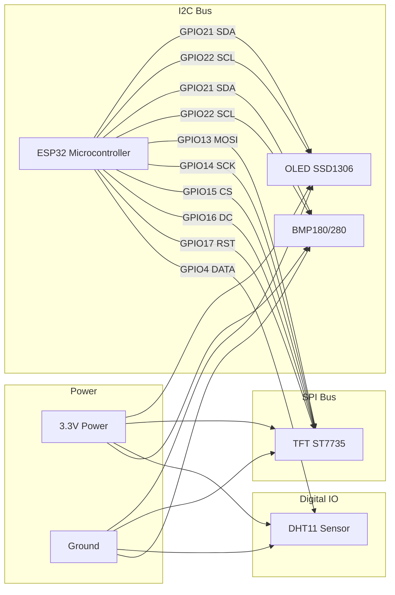

# ESP32 Dual-Display Weather Station - Wiring & Layout

## Overview
This project combines four distinct hardware modules connected to a single ESP32 microcontroller:
- **1x OLED Display (I2C)**: Monochrome 128x64 pixels (SSD1306)
- **1x TFT Display (SPI)**: Color 128x160 pixels (ST7735)
- **1x DHT11 Sensor**: Digital Temperature & Humidity
- **1x BMP180 / BMP280 Sensor (I2C)**: Barometric Pressure & Temperature

## Architecture Diagram

## Detailed Hardware Connections

| Module | Pin | ESP32 Pin | Protocol | Notes |
| :--- | :---: | :---: | :--- | :--- |
| **OLED (SSD1306)** | SDA | `21` | I2C | Shared with BMP180 |
| | SCL | `22` | I2C | Shared with BMP180 |
| | VCC | `3.3V` | Power | |
| | GND | `GND` | Ground | |
| **BMP180/BMP280** | SDA | `21` | I2C | Shared with OLED |
| | SCL | `22` | I2C | Shared with OLED |
| | VCC | `3.3V` | Power | |
| | GND | `GND` | Ground | |
| **TFT (ST7735)** | MOSI | `13` | SPI | Hardware SPI |
| | SCK / SCLK | `14` | SPI | Hardware SPI |
| | CS | `15` | SPI | Chip Select |
| | DC / RS | `16` | SPI | Data / Command |
| | RST / RES | `17` | SPI | Reset |
| | LED / BL | `3.3V` | Power | Backlight (can add resistor if too bright) |
| | VCC | `3.3V` | Power | |
| | GND | `GND` | Ground | |
| **DHT11 Sensor** | DATA | `4` | Digital | Needs 10k pull-up resistor to 3.3V (often built into breakout boards) |
| | VCC | `3.3V` | Power | |
| | GND | `GND` | Ground | |

---

## 🛠️ Build Advice

1. **Power**: The ESP32 3.3V regulator can usually handle all these modules if powered via a good USB cable. If the displays flicker or the ESP32 brown-out resets, you may need an external 3.3V power supply.
2. **I2C Bus**: The OLED and BMP180 share the same I2C pins (`21` and `22`). Ensure neither module has conflicting hardware addresses (OLED is usually `0x3C`, BMP is usually `0x77`).
3. **SPI Bus**: The TFT uses a dedicated SPI bus. Make sure to keep the wires as short as possible for stable high-speed drawing.
4. **DHT Resistor**: If your DHT11 is just the bare blue 4-pin component (not mounted on a little PCB), you MUST wire a 10k ohm resistor between the DATA pin and VCC.
